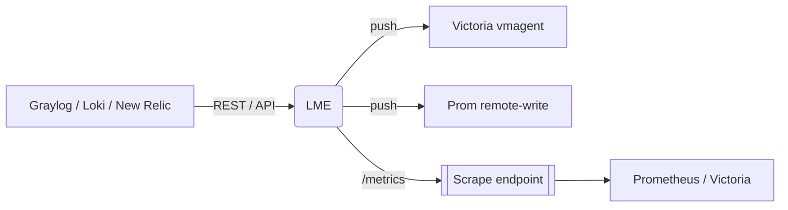

# Log-exporter &nbsp;–&nbsp; Logs-to-Metrics converter  

[](https://github.com/netcracker/qubership-log-exporter/actions/workflows/build.yml)
[](https://github.com/Netcracker/qubership-log-exporter/actions/workflows/github-code-scanning/codeql)
[](https://github.com/netcracker/qubership-log-exporter/releases)

> **LME** turns log records from Graylog, New Relic or Loki into real-time Prometheus metrics, pushing to Victoria Metrics / Prometheus remote-write or exposing a `/metrics` endpoint for scraping.

---

## 2. Features / key capabilities

* Multiple data sources: **Graylog**, **Loki**, **New Relic**
* Metric types: `counter`, `gauge`, `histogram`
* Powerful enrichment (regular expression, JSON-path, URI templating)
* Push (**Victoria vmagent**, **Prometheus remote-write**) or pull (`/metrics`) modes
* High-availability "last-timestamp" mechanism for exactly-once push
* Self-monitoring metrics and `/probe` health endpoint
* Live log-level tuning via **Consul KV**

## 3. Requirements

* Go ≥ 1.23 (for local builds) or Docker 20+
* Optional sources / sinks  
  * Graylog 3+, Loki, New Relic Insights API  
  * Victoria Metrics ≥ 1.68 / Prometheus ≥ 2.0 (remote-write compatible)
* Kubernetes 1.20+ (Helm chart provided) – or run standalone binary / container

## 4. Installation / Quick start

```bash
# Docker (latest release)
docker run ghcr.io/netcracker/qubership-log-exporter:main \
       --config-path=/path/to/config.yaml
# If your config runs in pull mode and exposes metrics on 8081, add '-p 8081:8081'.

# Native build
git clone https://github.com/netcracker/qubership-log-exporter.git
cd qubership-log-exporter
go build -o logexporter .
./logexporter --config-path=config.yaml
```

Kubernetes / OpenShift users:

```bash
# Using local Helm chart
helm install log-exporter ./charts/log-exporter \
     -f values.yaml              # customise as needed
```

## 5. Usage

Key CLI flags (full list: `--help`)

| Flag | Default | Purpose |
|------|---------|---------|
| `--config-path` | `config.yaml` | YAML config file |
| `--listen-address` | `""` | Optional address for `/metrics`; overrides pull-mode port from config |
| `--check-config` | `false` | Validate config & exit |
| `--version` | – | Print version |

Environment variables override secrets (e.g. `GRAYLOG_USER`, `VICTORIA_PASSWORD`, see docs).

## 6. Configuration

All behaviour is driven by a single YAML file.  
Sections: `datasources`, `exports`, `metrics`, `queries`, `flags`, `graylog-emulator`, `general`.

Examples:

* [`examples/config.yaml`](examples/config.yaml) – minimal
* [`examples/config_cloud_victoria.yaml`](examples/config_cloud_victoria.yaml) – Victoria Metrics push
* [`examples/unit_test.yaml`](examples/unit_test.yaml) – complex demo

Helm values mirror YAML keys; see [`charts/log-exporter/values.yaml`](charts/log-exporter/values.yaml).

## 7. API Reference / Documentation

* Installation notes – [`docs/installation-notes.md`](docs/installation-notes.md)
* User guide (detailed config schema) – [`docs/user-guide.md`](docs/user-guide.md)
* Example dashboards – _TODO_

## 8. Architecture / Diagram

### System overview



## 9. Testing

```bash
go test ./...        # unit tests
```

CI runs linting, unit tests and vulnerability scanning on every PR.

## 10. Contributing

See [`CONTRIBUTING.md`](CONTRIBUTING.md).  
Commit messages follow Conventional Commits; PR titles are linted automatically.

## 11. License

Apache 2.0 – see [`LICENSE`](LICENSE).
