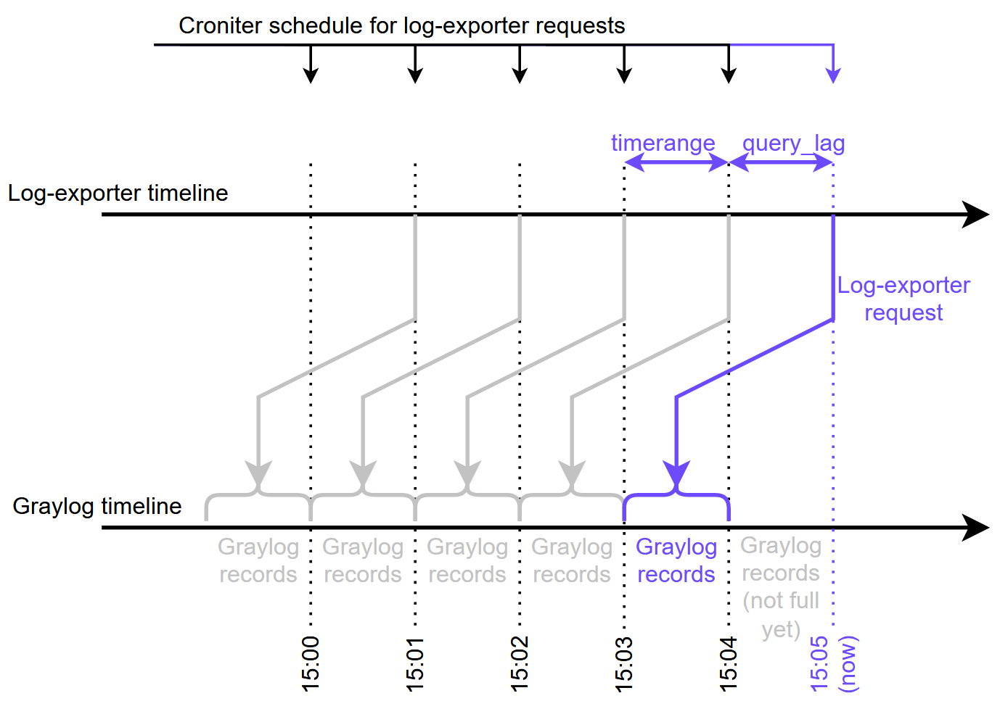

# Logs2Metrics (LME) User Guide

* [Logs2Metrics (LME) User Guide](#logs2metrics-lme-user-guide)
  * [Overview of Log Exporter](#overview-of-log-exporter)
  * [REST API](#rest-api)
  * [Command Line Arguments](#command-line-arguments)
  * [Environment Variables](#environment-variables)
  * [LME Self-metrics](#lme-self-metrics)
  * [YAML Configuration](#yaml-configuration)
    * [Base](#base)
    * [Datasources Section](#datasources-section)
    * [Exports Section](#exports-section)
    * [Metrics Section](#metrics-section)
    * [Queries Section](#queries-section)
    * [Flags Section](#flags-section)
    * [Graylog Emulator Section](#graylog-emulator-section)
    * [General Section](#general-section)
  * [YAML Configuration Example](#yaml-configuration-example)

## Overview of Log Exporter

The log-exporter (or Logs-to-Metrics-exporter, LME) tool is designed to evaluate Prometheus metrics on the basis of the records retrieved from the Graylog server, New Relic, or Loki via API. The log-exporter can count logged events, evaluate average or sum values for numerical graylog fields or the duration between logged events and provide results as Prometheus metrics of different types (counter, gauge, histogram). The log-exporter can enrich the received data with the use of regular expressions with templates and/or json-path. Any field can be used as a label for the metric. Log-exporter can push metrics to Victoria or Prometheus remote-write or metrics could be pulled from the `/metrics` endpoint by Prometheus, Victoria or any other consumer.

## REST API

* `/metrics` returns all collected metrics.

## Command Line Arguments

You can specify the following command-line arguments to configure the log-exporter binary execution.

| Name                      | Type   | Description                                        | Default            |
|---------------------------|--------|----------------------------------------------------|--------------------|
| check-config              | bool   | Print the log-exporter config analysis and exit    | false              |
| config-path               | string | Path to the YAML configuration                     | config.yaml        |
| croniter-precision        | string | Possible values: second, minute                    | second             |
| disable-self-monitor      | bool   | Disables self monitoring                           | false              |
| key-path                  | string | Path to the key for DSN encryption                 |                    |
| listen-address            | string | The address to listen (port) for HTTP requests     | :8080              |
| log-archivation           | bool   | Archiving rotated logs                             | true               |
| log-format                | string | Log messages in JSON (`json`, `cloud`, `text`)     | text               |
| log-level                 | string | Log level                                          | debug              |
| log-max-age               | int    | Set maximum age of log backups in days             | 90                 |
| log-max-backups           | int    | Set maximum number of log backups                  | 20                 |
| log-max-size              | int    | Set maximum log size in Mb which triggers rotation | 100                |
| log-path                  | string | Redirect log output to file (stdout if empty)      |                    |
| log-rotation              | bool   | Enabling log rotation                              | true               |
| version                   | bool   | Print the log-exporter version and exit            | false              |

## Environment Variables

You can specify the following environment variables to configure the log-exporter.

| Name                    | Type       | Description                                           | Default        |
|-------------------------|------------|-------------------------------------------------------|----------------|
| CONFIG_FILE_PERMS       | octal uint | Permissions for config.file                           | 0600           |
| KEY_FILE_PERMS          | octal uint | Permissions for key.file                              | 0600           |
| GRAYLOG_USER            | string     | Graylog REST API user                                 |                |
| GRAYLOG_PASSWORD        | string     | Password for the Graylog REST API user (not secure for non-cloud)|                |
| VICTORIA_USER           | string     | Victoria vmagent user                                 |                |
| VICTORIA_PASSWORD       | string     | Password for the Victoria vmagent user (not secure for non-cloud)|                |
| PROMRW_USER             | string     | Prometheus remote-write user                          |                |
| PROMRW_PASSWORD         | string     | Password for the Prometheus remote-write user (not secure for non-cloud)|                |
| LAST_TIMESTAMP_USER     | string     | Last timestamp service user                           |                |
| LAST_TIMESTAMP_PASSWORD | string     | Password for the last timestamp service user (not secure for non-cloud)|                |

## LME Self-metrics

Log-exporter provides self-metrics in Prometheus format. Supported metrics are all default Go application metrics and the following.

| Name                         | Type      | Description                                                               |
|------------------------------|-----------|---------------------------------------------------------------------------|
| data_exporter_cache_size     | Gauge     | Log-exporter cache size (number of entries)                               |
| graylog_response_error_count | Counter   | Count of errors during request to graylog and error responses             |
| query_latency                | Histogram | Graylog request execution latency by query                                |
| metric_evaluation_latency    | Histogram | Metric evaluation latency by metric                                       |
| enrich_evaluation_latency    | Histogram | Enrich evaluation latency by query, enrich_index                          |
| graylog_response_size        | Histogram | Graylog response size distribution by query                               |
| regex_matched                | Counter   | Count of regular expressions have been matched by query, enrich_index     |
| regex_not_matched            | Counter   | Count of regular expressions have not been matched by query, enrich_index |
| panic_recovery_count         | Counter   | Count of panics have been recovered by query, process                     |
| queue_size                   | Gauge     | Size of queues inside log-exporter application by query, queue            |

## YAML Configuration

### Base

Log-exporter configuration contains the following root sections:

* `apiVersion` (`optional`) - Contains configuration version, for example 1.0.0.0. If the version is lower than the  currently minimal supported version (currently minimal supported version is 1), log-exporter does not start.
* `kind` (`optional`) - Reserved for Kubernetes. Currently not used.
* `datasources` (`required`) - Contains a map of datasources to which the log-exporter is connected and from which it extracts metrics. The key of the map is the arbitrary datasource name (string); the value of the map is the datasource description. Currently, only one datasource is supported; if you need to collect metrics from several datasources, you can use several log-exporter instances and aggregate metrics on the prom-proxy or Prometheus level. For more information, see the [Datasources Section](#datasources-section).
* `exports` (`required`) - Contains a map of export configurations. The key of the map is the arbitrary export name (string); the value of the map is the export description. Each export configuration describes the way log-exporter exports metrics. Log-exporter can push metrics to the destination server (this approach is called push strategy) and/or expose metrics on the `/metrics` endpoint (this approach is called pull strategy). Currently only one exporter with push and/or one exporter with pull strategy are supported. For more information, see [Exports Section](#exports-section).
* `metrics` (`required`) - Contains a map of collected metric descriptions. The key of the map is the metric name (string). This name is used in the Prometheus output; the value of the map is the metric description. For more information, see [Metrics Section](#metrics-section).
* `queries` (`required`) - Contains a map of queries needed to execute for evaluating metrics. The key of the map is an arbitrary query name; the value of the map is query description. For more information, see [Queries Section](#queries-section).
* `flags` (`optional`) - Contains the log-exporter startup arguments map (string key and string value). For more information, see [Flags Section](#flags-section).
* `graylog-emulator` (`optional`) - Contains the Graylog emulator options. For more information, see [Graylog Emulator Section](#graylog-emulator-section).
* `general` (`optional`) - Contains the log-exporter general properties, which are not relevant to any section above. For more information, see [General Section](#general-section).

### Datasources Section

This section contains a map in which the string key is the datasource name and the value has the following properties:

* `host` (`required`) - Specifies the Graylog host endpoint in the `protocol`://`ip_or_hostname`:`port` format. Example: `http://127.0.0.1:9000`
* `user` (`required`) - Specifies the Graylog username; the same user can be used in Graylog UI.
* `password` (`optional`) - Specifies the password for the Graylog user.
* `type` (`optional`) - Specifies the type of the datasource, possible values are "graylog" and "newrelic". The default value is "graylog".
* `labels` (`optional`) - Contains a map with the key string and the value string of static labels and their values, which are automatically added to all log-exporter metrics.
* `connection-timeout` (`optional`) - Specifies the timeout for the TCP connection. The default value is "30s".
* `tls-insecure-skip-verify` (`optional`) - Controls whether a client verifies the server's certificate chain and hostname. The default value is "false".
* `tls-cert-file` (`optional`) - Specifies the path to the TLS certificate file. This property is empty by default.
* `tls-key-file` (`optional`) - Specifies the path to the TLS key file. This property is empty by default.
* `tls-ca-cert-file` (`optional`) - Specifies the path to the TLS CA file. This property is empty by default.

### Exports Section

This section contains a map in which the string key is the export name and the value has the following properties:

* `strategy` (`optional`) - Contains a string. The possible values are "push" (default value) and "pull".
* `consumer` (`optional`) - Contains a string. The possible values are "victoria-vmagent" (default value) and "prometheus-remote-write". It is needed only for the push strategy. This parameter is used to distinguish metric destination services for the push strategy. If a consumer is "victoria-vmagent", the log-exporter writes metrics plain-text (this format is usually called "Prometheus exposition format") on the provided vmagent endpoint of the Victoria Metrics, which usually is `/api/v1/import/prometheus`. If a consumer is "prometheus-remote-write", the log-exporter writes metrics in Prometheus remote-write binary format on the provided Prometheus remote-write endpoint, which usually is `/api/v1/write`.
* `port` (`optional`) - Contains a port number that is used for exposing metrics in the pull strategy. This parameter is needed only for the pull strategy.
* `host` (`optional`) - Specifies the destination host in the `protocol`://`ip_or_hostname`:`port` format. Usually it is victoria-vmagent host (if consumer is "victoria-vmagent") or carbon-clickhouse host (if consumer is "prometheus-remote-write"). This parameter is needed only for the push strategy.
* `endpoint` (`optional`) - Specifies the destination endpoint. For the "victoria-vmagent" consumer, it is usually `/api/v1/import/prometheus`; for the "prometheus-remote-write" consumer, it is usually `/api/v1/write`. This parameter is needed only for the push strategy.
* `user` (`optional`) - Specifies the Basic auth user for the host. This parameter is needed only for the push strategy. For the "prometheus-remote-write" consumer, the parameter is usually not needed.
* `password` (`optional`) - Specifies the password for the Basic auth user. This parameter is needed only for the push strategy. For the "prometheus-remote-write" consumer, the parameter is usually not needed.
* `connection-timeout` (`optional`) - Specifies the timeout for the TCP connection. The default value is "30s". This parameter is used only by the push strategy.
* `tls-insecure-skip-verify` (`optional`) - Controls whether a client verifies the server's certificate chain and hostname. The default value is "false". This parameter is used only by the push strategy.
* `tls-cert-file` (`optional`) - Specifies the path to TLS certificate file. This parameter is empty by default. It is used only by the push strategy.
* `tls-key-file` (`optional`) - Specifies the path to TLS key file. This parameter is empty by default. It is used only by the push strategy.
* `tls-ca-cert-file` (`optional`) - Specifies the path to TLS CA file. This parameter is empty by default. It is used only by the push strategy.
* `last-timestamp-host` (`required`) - Specifies the description of the host for the last timestamp extraction. This parameter is used only by the push strategy. It has the following properties:
  * *host* (optional) - Specifies the destination host in the `protocol`://`ip_or_hostname`:`port` format.
  * *user* (optional) - Specifies the Basic auth user for the destination host. For the "prometheus-remote-write" consumer, the parameter is usually not needed.
  * *password* (optional) - Specifies the password for the Basic auth user. For the "prometheus-remote-write" consumer, the parameter is usually not needed.
  * *connection-timeout* (optional), *tls-insecure-skip-verify (optional), *tls-cert-file* (optional), *tls-key-file* (optional), and *tls-ca-cert-file* (optional) are also available to configure the connection to the last timestamp host.

### Metrics Section

This section contains a map in which the string key is a metric name and the value has the following properties:

* `type` (`required`) - Specifies the metric type; supported types are __gauge__, __counter__, and __histogram__. The metric type is present in the Prometheus endpoint output in the TYPE section.
* `description` (`optional`) - Provides the metric description; description is present in the Prometheus endpoint output in the HELP section.
* `operation` (`required`) - Specifies the metric evaluation algorithm together with the `type` field. Currently, the following operations are supported:
  * __count__ - Counts the number of entries returned by the query. If labels are defined, counting is performed separately for each possible label-value combination. If the metric type is __counter__, the metric value is summed up with the previous metric value. If the metric type is __gauge__, the metric value is equal to the number of entries returned by the last query. The __histogram__ metric type is not supported for this operation. No special parameters are required (see section parameters below).
  * __duration__ - Evaluates the duration between events logged in Graylog, for example integration calls, HTTP calls, or any other processes. For proper duration metric functioning, correlated records for the start and end processes (or integration call request and response) must be logged in Graylog. If labels are defined, evaluation is performed separately for each label-value combination possible. If the metric type is __counter__, the value is summed up with the current average duration value of the metric for the specific label-value combination. If the metric type is __gauge__, the metric value is equal to the current average duration value of the metric for the specific label-value combination. If the metric type is __histogram__, all durations are distributed between buckets defined in the `buckets` section. The sum and count series are also evaluated accordingly. Duration metrics use the following parameters:   *value-field*, *time_field*, *time_format*, *message_type_field*, *message_type_request*, *message_type_response*, *correlation_id_field*, *cache*, *cache-update* (see the parameters section).
  * __value__ - In case of __counter__ and __gauge__ types, evaluates the average number of __value-field__ field defined in the parameters section for the last executed query. If labels are defined, evaluation is performed separately for each possible label-value combination. If the metric type is __counter__, the value is summed up with the current value of the metric. If the metric type is __gauge__, the metric value is equal to the average returned by the last query. If the metric type is __histogram__, all number values for the *value-field* field are distributed between buckets defined in the `buckets` section. The sum and count series are also evaluated accordingly. This metric requires the *value-field* parameter (see parameters section).
* `labels` (`optional`) - Specifies the list of metric label names (list of strings) in addition to the static labels, defined in the Database section. Values of the labels are evaluated on the basis of query execution results and equal to the values of the field with the name equal to the label name. Query for the metric evaluation must return Graylog fields with the same names as label names. The list may be empty.
* `label-field-map` (`optional`) - Contains a map with the string key for the label name and the string value for the field name. The map is used to define the label if its name is not equal to the name of the field where label values are taken from.
* `multi-value-fields` (`optional`) - Contains a list of multi-value field configurations. Multi-value fields are now supported only for the metrics of the type counter. Multi-value fields allow to increment several metric series of the metric for different values of the label *label-name* after processing of the single datasource log record. Label values for incrementing are stored in the *field-name* field as a string, in which label values are separated by a *separator* (usually the separator is ","). A multi-value field configuration contains the following properties:
  * *field-name* (required) - The Graylog field name where label values separated by a *separator* are stored.
  * *label-name* (required) - The name of the Prometheus label for which several label values can be incremented.
  * *separator* (optional) - The separator for the value of the *field-name* field. The default value is ",".
* `expected-labels` (`optional`) - Contains a list of mappings. Each mapping is a map where the key is a label name and the value is a list of expected label values. For each label name present in the labels section, the list of expected label values must contain at least one item; the number of map entries in each mapping must be equal to the size of the labels list. If any mapping does not satisfy these conditions, the entire expected-labels section is ignored. Expected labels are useful in conjunction with the default-value and init-value parameters because metric values for all possible combinations of expected labels are initialized (for counters and histograms) and reset (for gauges) according to these parameters.
* `id-field` (`optional`) - Specifies the string name of the field that contains the unique identifier. The option is valid only for the count operation. If the option is specified, the metric is evaluated in the unique counter mode, to which the following logic applies: The LME counts the record with the certain id-field value only once for the metric (if `id-field-strategy` is set to "metric") or for the label-values combination (if `id-field-strategy` is set to "label"). The records with the value of the id-field which encountered more than once are skipped and do not increase the value of the metric for the strategies above.
* `id-field-strategy` (`optional`) - Specifies the string that defines the strategy for the unique counter mode. The possible values are "metric" and "label". The default strategy is "label". The parameter is valid only for the counter operation and only if `id-field` parameter is specified for the metric.
* `id-field-ttl` (`optional`) - Specifies the time-to-live value for unique identifiers stored in the cache. It must be an integer value. It specifies the minimum number of successive Graylog requests for which the identifier is stored in the cache and can be used. The default value is "60". The parameter is valid only for the counter operation and only if `id-field` parameter is specified for the metric.
* `metric-value` (`required for value operation`) - Contains the string name of the field on the basis of which the metric value is calculated.
* `const-labels` (`required`) - Contains a map with the string key and the string value of static labels and their values, which are automatically added to the metric.
* `buckets` (`required for histogram`) - Contains the list of float64 bucket values (le label value of histogram).
* `threads` (`optional`) - Specifies the quantity of threads for metric evaluation in the multi-thread mode. If this value is less than 2, the metric is evaluated in the single-thread mode. By default single-thread mode is used.
* `conditions` (`optional`) - Contains a list of conditions. If the conditions list is not empty and there are no true conditions for a Graylog record, the Graylog record is skipped during the metric evaluation. Each condition is a map. The key of the map is a condition operation name. The value of the map is a condition operation parameters map that contains the required parameter names and values for the condition operation evaluation. Condition for the record is true only if all of the condition operations inside the condition for the record are true. Currently only one condition operation "equ" is supported, which allows to specify the precise values of Graylog fields that a Graylog record must have for taking part in the metric evaluation. Condition operation "equ" is true for the record only if all Graylog fields, which are specified in the key of the condition operation parameters map, are having precise values, which are specified in the value of the same map.
* `parameters` (`optional`) - Contains the mapping of parameters (string key and string value). The following parameters are supported:
  * *value-field* (required for value operation) - The name of the Graylog field with number values that are used for evaluations.
  * *time_field* (required for duration operation) - The name of the Graylog field that contains the event time.
  * *time_format* (optional for duration operation) - The time format for the *time_field*. By default, the time format is Unix-time in milliseconds. Time format examples: "02.01.2006 15:04:05.000", "2006-01-02T15:04:05.000Z".
  * *message_type_field* (required for duration operation) - The Graylog field name that allows us to distinguish the request and response (start event and stop event).
  * *message_type_request* (optional for duration operation) - The Graylog field value for a request (start event) in *message_type_field*. The default value is "request".
  * *message_type_response* (optional for duration operation) - The Graylog field value for a response (end event) in *message_type_field*. The default value is "response".
  * *correlation_id_field* (required for duration operation) - The Graylog field name for correlation ID. Each record with the *message_type_response* value in *message_type_field* must have a pair with the same value in *correlation_id_field* and *message_type_request* value in *message_type_field*. Different request-response pairs must have different values in correlation ID.
  * *cache* (optional for duration operation) - The cache name that is used by the duration metric. Cache stores the request times by their correlation_id for previous Graylog calls. Duration metrics can work without cache; however, it is not recommended because some request-response pairs may be lost for evaluation if the request and response were received by the log-exporter in different Graylog record batches.
  * *cache-update* (optional for duration operation) - Boolean value, "true" or "false". The default value is "false". This value must be set to "true" for one of the metrics, which is using the cache. Several metrics could use the same cache, but only one metric should update it.
  * *init-value* (optional) - Init value for counters (any non-negative number or "NaN"). Histograms are initialized with 0 if init-value is not empty. Other values for initialization are not supported.
  * *default-value* (optional) - The default value for gauge. This value is used for label values for which query is not returning now, but the value is returned before by a query or labels are present in the expected labels set. The value can be any number value or "NaN". The default value is "NaN".

### Queries Section

This section contains a map in which string key is a query name and value has the following properties:

* `datasources` (`optional`) - Contains the list of datasources to which a query is applied. Currently not used because log-exporter is connected to one datasource only.
* `metrics` (`required`) - Contains the list of metrics evaluated by the query. Metrics with the names defined in the list must be present in the metrics section.
* `streams` (`required`) - Specifies the Graylog stream IDs from which data is extracted as a list of strings.
* `query_string` (`required`) - Specifies the Graylog or New Relic query text. New Relic queries support text templates `{{.StartTime}}` and `{{.EndTime}}`. LME replaces `{{.EndTime}}` with the time from the scheduler with a `query_lag` step back. `{{.StartTime}}` is the `timerange` before the `{{.EndTime}}`.
* `timerange` (`required`) - Specifies the time interval length that is used for extracting records from the datasource during one query execution. Usually, this must be equal to the time between query executions defined in the croniter section, which is typically 1 minute. A timerange value example is `7s100ms500µs100ns`. Valid time units are "ns", "us" (or "µs"), "ms", "s", "m", and "h".
* `fields_in_order` (`required`) - Contains the Graylog fields to be extracted as a list of strings. Must contain at least one field inside.
* `query_lag` (`required`) - Specifies the time interval between the end of the timerange period and the moment of Graylog query execution. It is needed not to lose data because data usually reaches Graylog with delay. Time format is the same as for `timerange`.
* `croniter` (`required`) - Specifies the string with 5 or 6 space-separated expressions representing seconds (optional), minutes, hours, day of month, month, and day of week.
* `interval` (`optional`) - Technical parameter. Required if history processing is enabled (last timestamp host is set up). Must be equal to the timerange between croniter calls. Usually equal to "1m".
* `gts-queue-size` (`optional`) - Technical parameter. Specifies the size of the gts-queue.
* `gd-queue-size` (`optional`) - Technical parameter. Specifies the size of the gd-queue.
* `gm-queue-size` (`optional`) - Technical parameter. Specifies the size of the gm-queue.
* `last-timestamp-endpoint` (`optional`) - Specifies the endpoint for the last timestamp extraction for the metrics, evaluated by the query. Usually also contains the query for the last timestamp extraction as a request parameter after the endpoint.
* `last-timestamp-json-path` (`optional`) - Specifies the JSON path to the timestamp in the response from the last timestamp service.
* `max-history-lookup` (`optional`) - Limits the amount of history data processed by the log-exporter.
* `enrich` (`optional`) - Contains a list of enriched configurations. Enrich configuration allows to calculate additional fields on the basis of other fields. Enriches are calculated one by one, in the same order as it is declared in the configuration file. So, each enrich can use fields originated by Graylog or calculated by one of the previous enriches. New fields could be later used for metrics evaluation the same way as the fields originated from Graylog. Each enrich configuration may contain the following parameters:
  * `source-field` (required) - The name of the field, which is used as the data source for evaluation of the new field(s).
  * `json-path` (optional) - The parameter sets the json-path to the required JSON element. The parameter can be set only if the source-field data format is JSON. If both `json-path` and `regexp` are set, the source field data is processed by json-path, then the result of the json-path operation is processed by regular expression. If `regexp` is not set, the result of the json-path operation that is being applied is used as a value for the destination field. If the source field value is not a parsable JSON, the result of the json-path operation is "JSON_NOT_PARSED"; if there is an error during the application of json-path, the result of the operation is "JSONPATH_ERROR".
  * `regexp` (required) - The parameter sets the regular expression string, which is applied to the value of the source-field. Regular expression should contain the capturing groups in parentheses. Captured values are used for evaluating the new fields.
  * `threads` (optional) - The number of threads used for enrich evaluation. By default, one thread is used.
  * `dest-fields` (required) - The list of the destination fields configuration. Each element of the list has the following parameters:
    * `field-name` (required) - The name of the destination field. The name must be unique. The names of the other Graylog fields and destination fields that are used in the query configuration must be different.
    * `template` (required) - Template for the field value extraction. Template usually contains variables like __${1}__ and __${2}__ which refer to submatches captured by the regular expression in the field value.
    * `default-value` (optional) - The default value is used as the field value if the field value is not matched to the regular expression. If the default value is not set, the "NOT_MATCHED" value is used.
    * `uri-processing` (optional) - Special configuration for URI processing. Can be defined if the destination field value is supposed to be a URI with IDs (or uuids) inside. To decrease metric cardinality, IDs should be replaced inside URI with predefined values. URI processing configuration contains the following fields:
      * `uuid-replacer` (optional) - Contains a replacement string for the URI path elements, which are valid uuid. If the value is empty, uuid path elements are present in the destination field value as is.
      * `id-digit-quantity` (required, if id-replacer is present) - Contains the limit value for ID path elements. If a path element contains less digits inside, this path element is considered as non-id path element and is displayed in the destination field as is. If a path element contains more than or equal number of digits inside, this path element is considered as ID path element and is replaced by *id-replacer* in the destination field value.
      * `id-replacer` (optional) - Contains a replacement string for path elements, which contains not less than `id-digit-quantity` digits inside (path elements that contain not less than `id-digit-quantity` are considered as ID). If the value is empty, ID path elements are displayed in the destination field as is.
      * `number-replacer` (optional) - Contains a replacement string for URI path elements that are integer numbers (negative or positive). If the value is empty, number path elements are displayed in the destination field as is.
      * `fsm-replacer` (optional) - Contains a replacement string for path elements that have scored more than `fsm-replacer-limit` points during [Finite State Machine Analysis](img/FSM.PNG). If the value is empty, ID path elements are not analyzed by Finite State Machine. Note that Finite State Machine Analysis also uses other heuristics like the existence of at least one digit in the path element and the length of the path element.
      * `fsm-replacer-limit` (required, if fsm-replacer is present) - Contains fsm replacer limit value for path elements. If a path element has scored less points during Finite State Machine Analysis (see *fsm-replacer* field), this path element is considered as a non-id path element and is displayed in the destination field as is. If the path has scored more than or equal points during Finite State Machine Analysis, this path element is considered as an ID path element and is replaced by *fsm-replacer* in the destination field value.
* `caches` (`optional`) - Contains a map of caches. The cache is used only by duration metrics. The key of the map is the arbitrary name for the cache. The value of the map has the following parameters:
  * *size* (required) - Number of batches the cache supports. The oldest batches are removed from the cache.

You can see in the following figure how the *croniter*, *timerange*, and *query_lag* parameters specify the way the log-exporter pulls data from the Graylog server.

  

### Flags Section

This section contains a map for reloading the log-exporter startup arguments. The following flags are supported for reloading:

* `croniter-precision` (`optional`) - Specifies the croniter precision. The possible values are "second" and "minute". The default value is "second".

### Graylog Emulator Section

This section contains the LME graylog emulator options. The section is optional and usually used only on dev-environments. The following parameters are supported:

* `source-files` (`optional`) - Contains the list of the paths to the CSV-files. The CSV files must contain a valid Graylog output. The LME Graylog emulator reads the files one by one in the round-robin way and publishes the data from the files on the specified `endpoint`. Each HTTP-call of the endpoint returns the content of the next CSV file in the list. The LME Graylog emulator exposes the data on the same port as the LME exposes metrics (see datasources section, parameter `host`)
* `endpoint` (`optional`) - The endpoint on which the Graylog emulator exposes the Graylog emulator output. The default value is "/api/views/search/messages", which is the default Graylog API endpoint.
* `data` (`optional`) - Contains a list of Graylog emulator responses. Each entry of the list must contain a valid Graylog output. The LME Graylog emulator reads the list elements one by one in the round-robin way and publish the data from the list on the specified `endpoint`. This parameter is equal to the `source-files` parameter, but the `data` section allows to specify the Graylog emulator data directly in the configmap. If this section is defined, the files from the `source-files` section are ignored.

### General Section

This section contains a map of general log-exporter parameters. The following parameters are supported:

* `gm-queue-self-mon-size` (`optional`) - Sets up the size of GM queue for self-metrics. The default value is "60".
* `disable-push-cloud-labels` (`optional`) - Disables cloud labels (namespace, pod and container; values for the labels are the names of the namespace, the container, and the pod where the log-exporter instance is running) in push mode. The default value is false, that is, labels are enabled by default.
* `push-cloud-labels` (`optional`) - Sets up the map where key is a string label name and value is a string label value. All defined labels here are added to all pushing metrics. Pulling metrics remain the same. If there is a need to add labels to all metrics, pulling and pushing, use the datasources > labels section.
* `last-timestamp-retry-count` (`optional`) - Specifies the maximum number of attempts to extract the last timestamp from the monitoring database. If the number of attempts is exceeded, the log-exporter starts up without history data processing. The default value is "5".
* `last-timestamp-retry-period` (`optional`) - Specifies the time interval between retry attempts to extract the last timestamp. The default value is "10 seconds (10s)". An example of the time interval format is `7s100ms500µs100ns`. Valid time units are "ns", "us" (or "µs"), "ms", "s", "m", and "h".
* `datasource-retry` (`optional`) - Specifies whether the datasource retry mechanism is enabled. The possible values are "true" and "false". By default the datasource retry is enabled, which means that if the datasource (usually it is Graylog) fails to respond, the LME retries to extract the data with the retry period defined in `datasource-retry-period`.
* `datasource-retry-period` (`optional`) - Specifies the time period between retries for the datasource retry mechanism. The default value is "5s".
* `push-retry` (`optional`) - Specifies whether the push retry mechanism is enabled. The possible values are "true" and "false". By default the push retry is enabled, which means that if Prometheus fails to respond, LME retries to push the data with the retry period defined in `push-retry-period`.
* `push-retry-period` (`optional`) - Specifies the time period between retries for the push retry mechanism. The default value is "5s".

## YAML Configuration Example

Configuration:

```yaml
        apiVersion: "1.0.0.0"
        kind: cloud
        datasources:
          graylog1:
            host: <host>
            user: <user
            password: <password>
            tls-insecure-skip-verify: true
            labels:
              dbtype: graylog
        exports:
          prometheus:
            strategy: pull
            port: "8081"
          victoria1:
            strategy: push
            consumer: victoria-vmagent
            host: <host>
            endpoint: "/api/v1/import/prometheus"
            user: <user>
            password: <password>
            tls-insecure-skip-verify: true
            last-timestamp-host:
              host: <host>
              user: <user>
              password: <password>
              tls-insecure-skip-verify: true
        metrics:
          graylog_messages_count_total:
            type: "counter"
            description: "Metric counts total number of events"
            operation: "count"
          graylog_messages_count_total_by_host_by_container:
            type: "counter"
            description: "Metric counts total number of events"
            labels: ["hostname"]
            label-field-map:
              container_name: container
            operation: "count"
            threads: 2
          graylog_messages_gauge_total_by_host_by_container:
            type: "gauge"
            description: "Metric counts total number for the last minute"
            labels: ["hostname"]
            label-field-map:
              container_name: container
            operation: "count"
            threads: 2
          envoy_duration:
            type: "histogram"
            description: "Envoy duration"
            labels: ["method", "service", "status", "path"]
            label-field-map:
              node: hostname
              container_name: container
            metric-value: "duration"
            operation: "value"
            buckets: [0, 1, 5, 10, 50, 100, 500, 1000, 5000, 10000, 50000, 100000]
            threads: 2
        queries:
          query1:
              metrics: ["graylog_messages_count_total", "envoy_duration", "graylog_messages_count_total_by_host_by_container", "graylog_messages_gauge_total_by_host_by_container"]
              streams: ["000000000000000000000001"]
              query_string: '_exists_:level AND _exists_:container_id AND container: *gateway'
              fields_in_order: ["hostname", "message", "container"]
              croniter: '* * * * *'
              query_lag: "1m"
              interval: "1m"
              enrich:
                - source-field: message
                  regexp: '(?s).*Forward Request: .([A-Z]+) ([^ \?]+)[ \?].*Response: .([0-9])[0-9]{2} .*[^0-9]([0-9]+)ms.*' #multi-line regexp
                  threads: 2
                  dest-fields:
                    - field-name: method
                      template: "${1}"
                      default-value: "NOT_MATCHED_TO_REGEXP"
                    - field-name: path
                      template: "${2}"
                      default-value: "NOT_MATCHED_TO_REGEXP"
                      uri-processing:
                        uuid-replacer: "_UUID_"
                        id-digit-quantity: 4
                        id-replacer: "_ID_"
                        number-replacer: "_NUMBER_"
                    - field-name: status
                      template: "${3}xx"
                      default-value: "NOT_MATCHED_TO_REGEXP"
                    - field-name: duration
                      template: "${4}"
                      default-value: "NaN"
                - source-field: path
                  threads: 2
                  regexp: '[^ \?]*\/(v[0-9])\/[^ \?]+'
                  dest-fields:
                    - field-name: service
                      template: "${1}"
                      default-value: "UNKNOWN"
              gts-queue-size: 14400
              gd-queue-size: 1
              gm-queue-size: 10
              last-timestamp-endpoint: '/api/v1/query?query=timestamp(graylog_messages_count_total{dbtype="graylog"}[14d])'
              last-timestamp-json-path: "$.data.result[0].value[1]"
              max-history-lookup: 3h
        general:
          gm-queue-self-mon-size: 120
        #flags:
        #  disable-timestamp : true
```

Metrics:

```prometheus
        # HELP envoy_duration Envoy duration
        # TYPE envoy_duration histogram
        envoy_duration_bucket{container_name="container_name_1",dbtype="graylog",method="GET",node="node_name_1",path="/api/v1/path/to/endpoint",service="v1",status="2xx",le="0"} 0 1671453240000
        envoy_duration_bucket{container_name="container_name_1",dbtype="graylog",method="GET",node="node_name_1",path="/api/v1/path/to/endpoint",service="v1",status="2xx",le="1"} 0 1671453240000
        envoy_duration_bucket{container_name="container_name_1",dbtype="graylog",method="GET",node="node_name_1",path="/api/v1/path/to/endpoint",service="v1",status="2xx",le="5"} 0 1671453240000
        envoy_duration_bucket{container_name="container_name_1",dbtype="graylog",method="GET",node="node_name_1",path="/api/v1/path/to/endpoint",service="v1",status="2xx",le="10"} 0 1671453240000
        envoy_duration_bucket{container_name="container_name_1",dbtype="graylog",method="GET",node="node_name_1",path="/api/v1/path/to/endpoint",service="v1",status="2xx",le="50"} 2 1671453240000
        envoy_duration_bucket{container_name="container_name_1",dbtype="graylog",method="GET",node="node_name_1",path="/api/v1/path/to/endpoint",service="v1",status="2xx",le="100"} 2 1671453240000
        envoy_duration_bucket{container_name="container_name_1",dbtype="graylog",method="GET",node="node_name_1",path="/api/v1/path/to/endpoint",service="v1",status="2xx",le="500"} 2 1671453240000
        envoy_duration_bucket{container_name="container_name_1",dbtype="graylog",method="GET",node="node_name_1",path="/api/v1/path/to/endpoint",service="v1",status="2xx",le="1000"} 2 1671453240000
        envoy_duration_bucket{container_name="container_name_1",dbtype="graylog",method="GET",node="node_name_1",path="/api/v1/path/to/endpoint",service="v1",status="2xx",le="5000"} 2 1671453240000
        envoy_duration_bucket{container_name="container_name_1",dbtype="graylog",method="GET",node="node_name_1",path="/api/v1/path/to/endpoint",service="v1",status="2xx",le="10000"} 2 1671453240000
        envoy_duration_bucket{container_name="container_name_1",dbtype="graylog",method="GET",node="node_name_1",path="/api/v1/path/to/endpoint",service="v1",status="2xx",le="50000"} 2 1671453240000
        envoy_duration_bucket{container_name="container_name_1",dbtype="graylog",method="GET",node="node_name_1",path="/api/v1/path/to/endpoint",service="v1",status="2xx",le="100000"} 2 1671453240000
        envoy_duration_bucket{container_name="container_name_1",dbtype="graylog",method="GET",node="node_name_1",path="/api/v1/path/to/endpoint",service="v1",status="2xx",le="+Inf"} 2 1671453240000
        envoy_duration_sum{container_name="container_name_1",dbtype="graylog",method="GET",node="node_name_1",path="/api/v1/path/to/endpoint",service="v1",status="2xx"} 25 1671453240000
        envoy_duration_count{container_name="container_name_1",dbtype="graylog",method="GET",node="node_name_1",path="/api/v1/path/to/endpoint",service="v1",status="2xx"} 2 1671453240000
        ...
        # HELP graylog_messages_count_total Metric counts total number of events
        # TYPE graylog_messages_count_total counter
        graylog_messages_count_total{dbtype="graylog"} 2675 1671453240000
        # HELP graylog_messages_count_total_by_host_by_container Metric counts total number of events
        # TYPE graylog_messages_count_total_by_host_by_container counter
        graylog_messages_count_total_by_host_by_container{container_name="container_name_1",dbtype="graylog",hostname="node_name_1"} 5 1671453240000
        graylog_messages_count_total_by_host_by_container{container_name=container_name_2",dbtype="graylog",hostname="node_name_2"} 2 1671453240000
        ...
        # HELP graylog_messages_gauge_total_by_host_by_container Metric counts total number for the last minute
        # TYPE graylog_messages_gauge_total_by_host_by_container gauge
        graylog_messages_gauge_total_by_host_by_container{container_name="container_name_1",dbtype="graylog",hostname="node_name_1"} 5 1671453240000
        graylog_messages_gauge_total_by_host_by_container{container_name=container_name_2",dbtype="graylog",hostname="node_name_2"} 2 1671453240000
        ...
        # HELP enrich_evaluation_latency Enrich evaluation latency in seconds (enrich_index starts from 0)
        # TYPE enrich_evaluation_latency histogram
        enrich_evaluation_latency_bucket{dbtype="graylog",enrich_index="0",query_name="query1",le="0.01"} 0 1671453310779
        enrich_evaluation_latency_bucket{dbtype="graylog",enrich_index="0",query_name="query1",le="0.1"} 1 1671453310779
        enrich_evaluation_latency_bucket{dbtype="graylog",enrich_index="0",query_name="query1",le="0.5"} 1 1671453310779
        enrich_evaluation_latency_bucket{dbtype="graylog",enrich_index="0",query_name="query1",le="1"} 1 1671453310779
        enrich_evaluation_latency_bucket{dbtype="graylog",enrich_index="0",query_name="query1",le="5"} 1 1671453310779
        enrich_evaluation_latency_bucket{dbtype="graylog",enrich_index="0",query_name="query1",le="10"} 1 1671453310779
        enrich_evaluation_latency_bucket{dbtype="graylog",enrich_index="0",query_name="query1",le="30"} 1 1671453310779
        enrich_evaluation_latency_bucket{dbtype="graylog",enrich_index="0",query_name="query1",le="60"} 1 1671453310779
        enrich_evaluation_latency_bucket{dbtype="graylog",enrich_index="0",query_name="query1",le="+Inf"} 1 1671453310779
        enrich_evaluation_latency_sum{dbtype="graylog",enrich_index="0",query_name="query1"} 0.0604816 1671453310779
        enrich_evaluation_latency_count{dbtype="graylog",enrich_index="0",query_name="query1"} 1 1671453310779
        enrich_evaluation_latency_bucket{dbtype="graylog",enrich_index="1",query_name="query1",le="0.01"} 1 1671453310779
        enrich_evaluation_latency_bucket{dbtype="graylog",enrich_index="1",query_name="query1",le="0.1"} 1 1671453310779
        enrich_evaluation_latency_bucket{dbtype="graylog",enrich_index="1",query_name="query1",le="0.5"} 1 1671453310779
        enrich_evaluation_latency_bucket{dbtype="graylog",enrich_index="1",query_name="query1",le="1"} 1 1671453310779
        enrich_evaluation_latency_bucket{dbtype="graylog",enrich_index="1",query_name="query1",le="5"} 1 1671453310779
        enrich_evaluation_latency_bucket{dbtype="graylog",enrich_index="1",query_name="query1",le="10"} 1 1671453310779
        enrich_evaluation_latency_bucket{dbtype="graylog",enrich_index="1",query_name="query1",le="30"} 1 1671453310779
        enrich_evaluation_latency_bucket{dbtype="graylog",enrich_index="1",query_name="query1",le="60"} 1 1671453310779
        enrich_evaluation_latency_bucket{dbtype="graylog",enrich_index="1",query_name="query1",le="+Inf"} 1 1671453310779
        enrich_evaluation_latency_sum{dbtype="graylog",enrich_index="1",query_name="query1"} 0.0060212 1671453310779
        enrich_evaluation_latency_count{dbtype="graylog",enrich_index="1",query_name="query1"} 1 1671453310779
        # HELP go_gc_duration_seconds A summary of the pause duration of garbage collection cycles.
        # TYPE go_gc_duration_seconds summary
        go_gc_duration_seconds{quantile="0"} 0
        go_gc_duration_seconds{quantile="0.25"} 0
        go_gc_duration_seconds{quantile="0.5"} 0
        go_gc_duration_seconds{quantile="0.75"} 0
        go_gc_duration_seconds{quantile="1"} 0.0010019
        go_gc_duration_seconds_sum 0.0010019
        go_gc_duration_seconds_count 10
        # HELP go_goroutines Number of goroutines that currently exist.
        # TYPE go_goroutines gauge
        go_goroutines 24
        # HELP go_info Information about the Go environment.
        # TYPE go_info gauge
        go_info{version="go1.19"} 1
        # HELP go_memstats_alloc_bytes Number of bytes allocated and still in use.
        # TYPE go_memstats_alloc_bytes gauge
        go_memstats_alloc_bytes 3.846224e+06
        # HELP go_memstats_alloc_bytes_total Total number of bytes allocated, even if freed.
        # TYPE go_memstats_alloc_bytes_total counter
        go_memstats_alloc_bytes_total 2.7751784e+07
        # HELP go_memstats_buck_hash_sys_bytes Number of bytes used by the profiling bucket hash table.
        # TYPE go_memstats_buck_hash_sys_bytes gauge
        go_memstats_buck_hash_sys_bytes 6981
        # HELP go_memstats_frees_total Total number of frees.
        # TYPE go_memstats_frees_total counter
        go_memstats_frees_total 162996
        # HELP go_memstats_gc_sys_bytes Number of bytes used for garbage collection system metadata.
        # TYPE go_memstats_gc_sys_bytes gauge
        go_memstats_gc_sys_bytes 7.843096e+06
        # HELP go_memstats_heap_alloc_bytes Number of heap bytes allocated and still in use.
        # TYPE go_memstats_heap_alloc_bytes gauge
        go_memstats_heap_alloc_bytes 3.846224e+06
        # HELP go_memstats_heap_idle_bytes Number of heap bytes waiting to be used.
        # TYPE go_memstats_heap_idle_bytes gauge
        go_memstats_heap_idle_bytes 1.011712e+07
        # HELP go_memstats_heap_inuse_bytes Number of heap bytes that are in use.
        # TYPE go_memstats_heap_inuse_bytes gauge
        go_memstats_heap_inuse_bytes 6.135808e+06
        # HELP go_memstats_heap_objects Number of allocated objects.
        # TYPE go_memstats_heap_objects gauge
        go_memstats_heap_objects 21824
        # HELP go_memstats_heap_released_bytes Number of heap bytes released to OS.
        # TYPE go_memstats_heap_released_bytes gauge
        go_memstats_heap_released_bytes 9.13408e+06
        # HELP go_memstats_heap_sys_bytes Number of heap bytes obtained from system.
        # TYPE go_memstats_heap_sys_bytes gauge
        go_memstats_heap_sys_bytes 1.6252928e+07
        # HELP go_memstats_last_gc_time_seconds Number of seconds since 1970 of last garbage collection.
        # TYPE go_memstats_last_gc_time_seconds gauge
        go_memstats_last_gc_time_seconds 1.671453306582379e+09
        # HELP go_memstats_lookups_total Total number of pointer lookups.
        # TYPE go_memstats_lookups_total counter
        go_memstats_lookups_total 0
        # HELP go_memstats_mallocs_total Total number of mallocs.
        # TYPE go_memstats_mallocs_total counter
        go_memstats_mallocs_total 184820
        # HELP go_memstats_mcache_inuse_bytes Number of bytes in use by mcache structures.
        # TYPE go_memstats_mcache_inuse_bytes gauge
        go_memstats_mcache_inuse_bytes 18688
        # HELP go_memstats_mcache_sys_bytes Number of bytes used for mcache structures obtained from system.
        # TYPE go_memstats_mcache_sys_bytes gauge
        go_memstats_mcache_sys_bytes 32704
        # HELP go_memstats_mspan_inuse_bytes Number of bytes in use by mspan structures.
        # TYPE go_memstats_mspan_inuse_bytes gauge
        go_memstats_mspan_inuse_bytes 161704
        # HELP go_memstats_mspan_sys_bytes Number of bytes used for mspan structures obtained from system.
        # TYPE go_memstats_mspan_sys_bytes gauge
        go_memstats_mspan_sys_bytes 212160
        # HELP go_memstats_next_gc_bytes Number of heap bytes when next garbage collection will take place.
        # TYPE go_memstats_next_gc_bytes gauge
        go_memstats_next_gc_bytes 5.846784e+06
        # HELP go_memstats_other_sys_bytes Number of bytes used for other system allocations.
        # TYPE go_memstats_other_sys_bytes gauge
        go_memstats_other_sys_bytes 2.584163e+06
        # HELP go_memstats_stack_inuse_bytes Number of bytes in use by the stack allocator.
        # TYPE go_memstats_stack_inuse_bytes gauge
        go_memstats_stack_inuse_bytes 524288
        # HELP go_memstats_stack_sys_bytes Number of bytes obtained from system for stack allocator.
        # TYPE go_memstats_stack_sys_bytes gauge
        go_memstats_stack_sys_bytes 524288
        # HELP go_memstats_sys_bytes Number of bytes obtained from system.
        # TYPE go_memstats_sys_bytes gauge
        go_memstats_sys_bytes 2.745632e+07
        # HELP go_threads Number of OS threads created.
        # TYPE go_threads gauge
        go_threads 19
        # HELP graylog_response_error_count Graylog response error count to log-exporter by query
        # TYPE graylog_response_error_count counter
        graylog_response_error_count{dbtype="graylog",query_name="query1"} 0 1671453310779
        # HELP graylog_response_size Graylog response size to log-exporter in bytes by query
        # TYPE graylog_response_size histogram
        graylog_response_size_bucket{dbtype="graylog",query_name="query1",le="1"} 0 1671453310779
        graylog_response_size_bucket{dbtype="graylog",query_name="query1",le="32"} 0 1671453310779
        graylog_response_size_bucket{dbtype="graylog",query_name="query1",le="1024"} 0 1671453310779
        graylog_response_size_bucket{dbtype="graylog",query_name="query1",le="32768"} 0 1671453310779
        graylog_response_size_bucket{dbtype="graylog",query_name="query1",le="1.048576e+06"} 0 1671453310779
        graylog_response_size_bucket{dbtype="graylog",query_name="query1",le="3.3554432e+07"} 1 1671453310779
        graylog_response_size_bucket{dbtype="graylog",query_name="query1",le="1.073741824e+09"} 1 1671453310779
        graylog_response_size_bucket{dbtype="graylog",query_name="query1",le="+Inf"} 1 1671453310779
        graylog_response_size_sum{dbtype="graylog",query_name="query1"} 1.538454e+06 1671453310779
        graylog_response_size_count{dbtype="graylog",query_name="query1"} 1 1671453310779
        # HELP metric_evaluation_latency Metric evaluation latency in seconds
        # TYPE metric_evaluation_latency histogram
        metric_evaluation_latency_bucket{dbtype="graylog",metric_name="envoy_duration",le="0.01"} 1 1671453310779
        metric_evaluation_latency_bucket{dbtype="graylog",metric_name="envoy_duration",le="0.1"} 1 1671453310779
        metric_evaluation_latency_bucket{dbtype="graylog",metric_name="envoy_duration",le="0.5"} 1 1671453310779
        metric_evaluation_latency_bucket{dbtype="graylog",metric_name="envoy_duration",le="1"} 1 1671453310779
        metric_evaluation_latency_bucket{dbtype="graylog",metric_name="envoy_duration",le="5"} 1 1671453310779
        metric_evaluation_latency_bucket{dbtype="graylog",metric_name="envoy_duration",le="10"} 1 1671453310779
        metric_evaluation_latency_bucket{dbtype="graylog",metric_name="envoy_duration",le="30"} 1 1671453310779
        metric_evaluation_latency_bucket{dbtype="graylog",metric_name="envoy_duration",le="60"} 1 1671453310779
        metric_evaluation_latency_bucket{dbtype="graylog",metric_name="envoy_duration",le="+Inf"} 1 1671453310779
        metric_evaluation_latency_sum{dbtype="graylog",metric_name="envoy_duration"} 0.0060014 1671453310779
        metric_evaluation_latency_count{dbtype="graylog",metric_name="envoy_duration"} 1 1671453310779
        metric_evaluation_latency_bucket{dbtype="graylog",metric_name="graylog_messages_count_total",le="0.01"} 1 1671453310779
        metric_evaluation_latency_bucket{dbtype="graylog",metric_name="graylog_messages_count_total",le="0.1"} 1 1671453310779
        metric_evaluation_latency_bucket{dbtype="graylog",metric_name="graylog_messages_count_total",le="0.5"} 1 1671453310779
        metric_evaluation_latency_bucket{dbtype="graylog",metric_name="graylog_messages_count_total",le="1"} 1 1671453310779
        metric_evaluation_latency_bucket{dbtype="graylog",metric_name="graylog_messages_count_total",le="5"} 1 1671453310779
        metric_evaluation_latency_bucket{dbtype="graylog",metric_name="graylog_messages_count_total",le="10"} 1 1671453310779
        metric_evaluation_latency_bucket{dbtype="graylog",metric_name="graylog_messages_count_total",le="30"} 1 1671453310779
        metric_evaluation_latency_bucket{dbtype="graylog",metric_name="graylog_messages_count_total",le="60"} 1 1671453310779
        metric_evaluation_latency_bucket{dbtype="graylog",metric_name="graylog_messages_count_total",le="+Inf"} 1 1671453310779
        metric_evaluation_latency_sum{dbtype="graylog",metric_name="graylog_messages_count_total"} 0 1671453310779
        metric_evaluation_latency_count{dbtype="graylog",metric_name="graylog_messages_count_total"} 1 1671453310779
        metric_evaluation_latency_bucket{dbtype="graylog",metric_name="graylog_messages_count_total_by_host_by_container",le="0.01"} 1 1671453310779
        metric_evaluation_latency_bucket{dbtype="graylog",metric_name="graylog_messages_count_total_by_host_by_container",le="0.1"} 1 1671453310779
        metric_evaluation_latency_bucket{dbtype="graylog",metric_name="graylog_messages_count_total_by_host_by_container",le="0.5"} 1 1671453310779
        metric_evaluation_latency_bucket{dbtype="graylog",metric_name="graylog_messages_count_total_by_host_by_container",le="1"} 1 1671453310779
        metric_evaluation_latency_bucket{dbtype="graylog",metric_name="graylog_messages_count_total_by_host_by_container",le="5"} 1 1671453310779
        metric_evaluation_latency_bucket{dbtype="graylog",metric_name="graylog_messages_count_total_by_host_by_container",le="10"} 1 1671453310779
        metric_evaluation_latency_bucket{dbtype="graylog",metric_name="graylog_messages_count_total_by_host_by_container",le="30"} 1 1671453310779
        metric_evaluation_latency_bucket{dbtype="graylog",metric_name="graylog_messages_count_total_by_host_by_container",le="60"} 1 1671453310779
        metric_evaluation_latency_bucket{dbtype="graylog",metric_name="graylog_messages_count_total_by_host_by_container",le="+Inf"} 1 1671453310779
        metric_evaluation_latency_sum{dbtype="graylog",metric_name="graylog_messages_count_total_by_host_by_container"} 0.0030121 1671453310779
        metric_evaluation_latency_count{dbtype="graylog",metric_name="graylog_messages_count_total_by_host_by_container"} 1 1671453310779
        metric_evaluation_latency_bucket{dbtype="graylog",metric_name="graylog_messages_gauge_total_by_host_by_container",le="0.01"} 1 1671453310779
        metric_evaluation_latency_bucket{dbtype="graylog",metric_name="graylog_messages_gauge_total_by_host_by_container",le="0.1"} 1 1671453310779
        metric_evaluation_latency_bucket{dbtype="graylog",metric_name="graylog_messages_gauge_total_by_host_by_container",le="0.5"} 1 1671453310779
        metric_evaluation_latency_bucket{dbtype="graylog",metric_name="graylog_messages_gauge_total_by_host_by_container",le="1"} 1 1671453310779
        metric_evaluation_latency_bucket{dbtype="graylog",metric_name="graylog_messages_gauge_total_by_host_by_container",le="5"} 1 1671453310779
        metric_evaluation_latency_bucket{dbtype="graylog",metric_name="graylog_messages_gauge_total_by_host_by_container",le="10"} 1 1671453310779
        metric_evaluation_latency_bucket{dbtype="graylog",metric_name="graylog_messages_gauge_total_by_host_by_container",le="30"} 1 1671453310779
        metric_evaluation_latency_bucket{dbtype="graylog",metric_name="graylog_messages_gauge_total_by_host_by_container",le="60"} 1 1671453310779
        metric_evaluation_latency_bucket{dbtype="graylog",metric_name="graylog_messages_gauge_total_by_host_by_container",le="+Inf"} 1 1671453310779
        metric_evaluation_latency_sum{dbtype="graylog",metric_name="graylog_messages_gauge_total_by_host_by_container"} 0.0009994 1671453310779
        metric_evaluation_latency_count{dbtype="graylog",metric_name="graylog_messages_gauge_total_by_host_by_container"} 1 1671453310779
        # HELP process_cpu_seconds_total Total user and system CPU time spent in seconds.
        # TYPE process_cpu_seconds_total counter
        process_cpu_seconds_total 0.375
        # HELP process_max_fds Maximum number of open file descriptors.
        # TYPE process_max_fds gauge
        process_max_fds 1.6777216e+07
        # HELP process_open_fds Number of open file descriptors.
        # TYPE process_open_fds gauge
        process_open_fds 267
        # HELP process_resident_memory_bytes Resident memory size in bytes.
        # TYPE process_resident_memory_bytes gauge
        process_resident_memory_bytes 2.9986816e+07
        # HELP process_start_time_seconds Start time of the process since unix epoch in seconds.
        # TYPE process_start_time_seconds gauge
        process_start_time_seconds 1.67145328e+09
        # HELP process_virtual_memory_bytes Virtual memory size in bytes.
        # TYPE process_virtual_memory_bytes gauge
        process_virtual_memory_bytes 3.3583104e+07
        # HELP query_latency Query execution latency in seconds
        # TYPE query_latency histogram
        query_latency_bucket{dbtype="graylog",query_name="query1",le="0.01"} 0 1671453310779
        query_latency_bucket{dbtype="graylog",query_name="query1",le="0.1"} 0 1671453310779
        query_latency_bucket{dbtype="graylog",query_name="query1",le="0.5"} 0 1671453310779
        query_latency_bucket{dbtype="graylog",query_name="query1",le="1"} 0 1671453310779
        query_latency_bucket{dbtype="graylog",query_name="query1",le="5"} 1 1671453310779
        query_latency_bucket{dbtype="graylog",query_name="query1",le="10"} 1 1671453310779
        query_latency_bucket{dbtype="graylog",query_name="query1",le="30"} 1 1671453310779
        query_latency_bucket{dbtype="graylog",query_name="query1",le="60"} 1 1671453310779
        query_latency_bucket{dbtype="graylog",query_name="query1",le="+Inf"} 1 1671453310779
        query_latency_sum{dbtype="graylog",query_name="query1"} 1.3925285 1671453310779
        query_latency_count{dbtype="graylog",query_name="query1"} 1 1671453310779
        # HELP queue_size Size of queues inside log-exporter application
        # TYPE queue_size gauge
        queue_size{dbtype="graylog",query_name="__SELF_METRICS__",queue_name="GMQueue"} 0 1671453310779
        queue_size{dbtype="graylog",query_name="query1",queue_name="GDQueue"} 0 1671453310779
        queue_size{dbtype="graylog",query_name="query1",queue_name="GMQueue"} 0 1671453310779
        queue_size{dbtype="graylog",query_name="query1",queue_name="GTSQueue"} 0 1671453310779
        # HELP regex_matched Count of regular expressions have been matched per query, enrich_index
        # TYPE regex_matched counter
        regex_matched{dbtype="graylog",enrich_index="0",query_name="query1"} 10556 1671453310779
        regex_matched{dbtype="graylog",enrich_index="1",query_name="query1"} 2293 1671453310779
        # HELP regex_not_matched Count of regular expressions have been not matched per query, enrich_index
        # TYPE regex_not_matched counter
        regex_not_matched{dbtype="graylog",enrich_index="0",query_name="query1"} 144 1671453310779
        regex_not_matched{dbtype="graylog",enrich_index="1",query_name="query1"} 382 1671453310779
```
